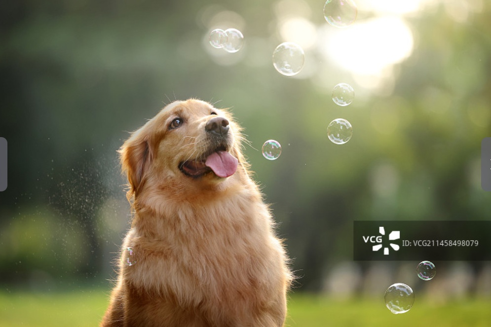
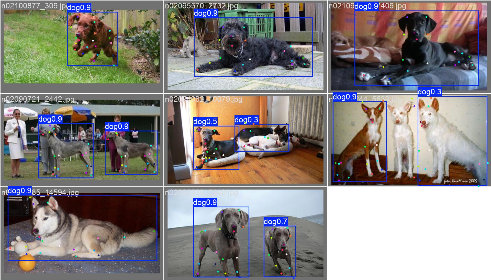
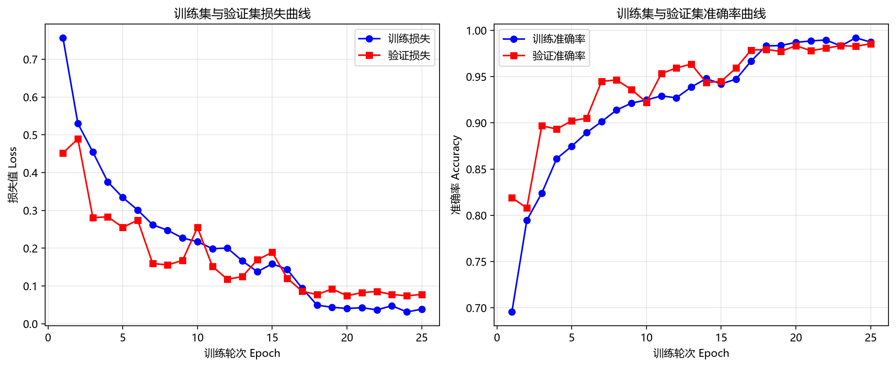
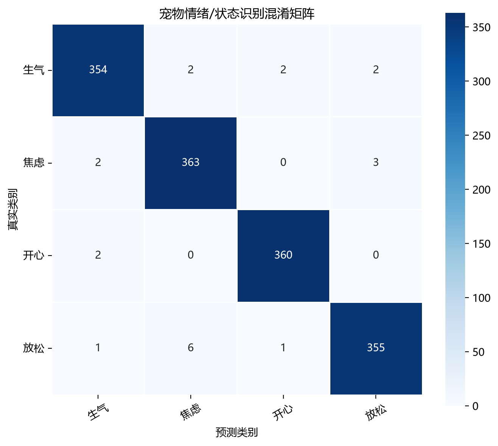
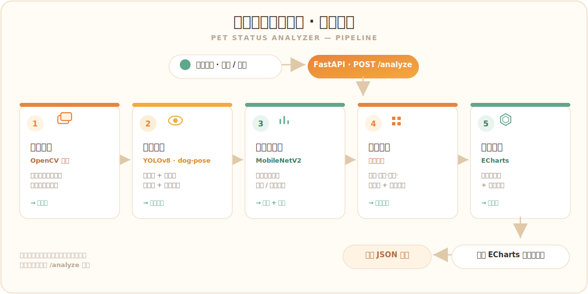

# 宠物状态分析系统 · Pet Status Analyzer


📖 **简体中文** | [English](README.en.md)

上传宠物短视频或图片 → **YOLOv8** 检测猫狗 → 自动挑选最佳帧 → **dog-pose** 姿态与 **MobileNetV2** 情绪识别 → 决策融合出**六维状态指数** → 前端用 **ECharts** 雷达图与趣味文案展示。一条完整的计算机视觉 / 模式识别流水线，FastAPI 后端，前端同源、**断网也能演示**。

> ⚠️ 系统输出的是**状态指数**（基于视觉特征、运动信息与分类模型概率构建），用于趣味化分析与可视化展示，**并非对宠物真实情绪的绝对判断**。

---

## ✨ 功能特性

- 🎯 **目标检测**：YOLOv8 检测猫/狗，输出边界框、类别与置信度
- 🖼️ **最佳帧选择**：置信度 + 清晰度（拉普拉斯方差）+ 居中度 + 面积比 多准则加权评分
- 🦴 **姿态与行为**：dog-pose 关键点回归 → 静态姿态（坐/趴/站）+ 视频动态行为时间轴
- 😀 **情绪分类**：迁移学习 MobileNetV2，输出 happy / angry / relaxed / anxious 概率
- 📊 **六维状态指数**：决策层多源融合 → 开心 / 活跃 / 生气 / 疑惑 / 警觉 / 好狗指数
- 🌐 **同源访问 + 离线自包含**：手机同 Wi-Fi 即开即用，ECharts 与演示数据本地化

## 🖼️ 效果展示

| 目标检测 · 最佳帧 | 姿态关键点（验证集预测） |
| --- | --- |
|  |  |

| 情绪模型训练曲线 | 混淆矩阵 |
| --- | --- |
|  |  |

## 🏗️ 系统架构



> 模块解耦：五个算法环节统一由后端编排，前端只对接一个 `/analyze` 接口。

## 🧠 技术流水线

| 阶段 | 技术 | 输入 → 输出 |
| --- | --- | --- |
| 目标检测 | YOLOv8（单阶段 + NMS） | 抽帧图像 → 检测框 + 类别 + 置信度 |
| 最佳帧 | 多准则加权评分 | 候选帧 → 最佳帧 + 裁剪主体 |
| 姿态/行为 | YOLOv8-pose 关键点回归 | 帧/视频 → 关键点 + 姿态 + 行为时间轴 |
| 情绪分类 | MobileNetV2 迁移学习 | 裁剪主体图 → 四类状态概率 |
| 指数融合 | 规则加权（决策层） | 概率 + 运动 + 质量 + 置信度 → 六维指数 |

## 📦 目录结构

```
pet_project/
├── main.py                  # FastAPI 后端，统一接口 /analyze
├── requirements.txt
├── modules/
│   ├── detection/           # 检测：抽帧 / YOLO / 最佳帧 / dog-pose 姿态行为
│   │   ├── pet_analyzer.py      #   统一入口 analyze_pet()
│   │   ├── video_process.py     #   抽帧 / 检测 / 最佳帧 / 裁剪 / 运动分
│   │   └── dog_pose/            #   关键点姿态 + 多帧动态行为
│   ├── emotion/             # 情绪分类：迁移学习模型
│   │   ├── emotion_predictor.py / model.py / train.py
│   │   ├── models/              #   emotion_model.pth（见下方权重说明）
│   │   └── results/            #   准确率曲线 / 混淆矩阵
│   └── scoring/            # 六维指数 + 趣味文案
│       ├── score_calculator.py
│       └── text_generator.py
├── static/                 # 前端：index.html / app.js / style.css（含离线 ECharts 与演示图）
├── weights/                # YOLO 检测权重（运行时自动下载）
└── uploads/                # 运行时上传文件
```

## 🚀 快速开始

```bash
conda create -n petdemo python=3.10
conda activate petdemo
pip install -r requirements.txt
python main.py            # 端口被占用时：PORT=8080 python main.py
```

- 电脑访问：`http://localhost:8000/static/index.html`
- 手机访问（同 Wi-Fi）：`http://<电脑局域网IP>:8000/static/index.html`（前端用 `window.location.origin` 自动适配，必要时放行防火墙端口）

> **WinError 10013 / 端口被占用？** Windows 有时保留 8000 端口（`netsh interface ipv4 show excludedportrange protocol=tcp` 可查），用 `PORT=8080 python main.py` 换端口即可，无需改代码。

## 🔌 接口 `/analyze`

`POST /analyze`，表单字段 `file`（图片或视频），返回 JSON：

```json
{
  "success": true,
  "animal": "dog",
  "animal_confidence": 0.93,
  "best_frame_url": "/static/results/xxx_best_frame.jpg",
  "emotion_probs": { "happy": 0.72, "angry": 0.08, "relaxed": 0.15, "anxious": 0.05 },
  "scores": {
    "开心指数": 82, "活跃指数": 72, "生气指数": 9,
    "疑惑指数": 31, "警觉指数": 27, "好狗指数": 88
  },
  "comment": "这是一只状态不错的狗狗，开心指数较高。"
}
```

视频输入还会额外返回 `video_behavior` / `static_pose` / `detection_video_url` 等字段。

## 🏋️ 模型训练与权重

为保持仓库轻量，较大的模型权重（`*.pt` / `*.pth`）未纳入 Git，可从 [**Releases**](../../releases) 下载，或自行训练：

| 权重 | 位置 | 获取方式 |
| --- | --- | --- |
| YOLOv8 检测 `yolov8n.pt` | `weights/` | 首次运行由 `ultralytics` **自动下载** |
| dog-pose 姿态 `best.pt` | `modules/detection/dog_pose/weights/` | [Releases](../../releases) 下载，或 `train_dog_pose.py` 训练 |
| 情绪模型 `emotion_model.pth` | `modules/emotion/models/` | [Releases](../../releases) 下载，或 `python -m modules.emotion.train` 训练 |

> 缺少 `emotion_model.pth` 时系统不会崩溃：后端自动回退为占位概率，仍可跑通完整流程与演示。
> dog-pose 数据集参考 [Ultralytics dog-pose](https://docs.ultralytics.com/datasets/pose/dog-pose/)。

训练情绪模型：数据按类别分文件夹后运行 `python -m modules.emotion.train`（配置见脚本顶部）。

## 🧩 模块自测

```bash
python -m modules.scoring.score_calculator    # 六维指数
python -m modules.scoring.text_generator      # 趣味文案
python -m modules.emotion.test_c_e            # 情绪→指数链路（占位概率）
python -m modules.detection.pet_analyzer modules/detection/dog_pose/test_images/dog6.jpg
```

## 🗺️ Roadmap

- 引入时序模型（LSTM / TCN / ST-GCN）做更稳定的动态行为识别
- 扩充情绪与关键点数据，提升遮挡 / 背影 / 模糊场景下的鲁棒性
- 端侧与移动端轻量化部署

## 🎬 离线演示

前端「使用演示数据」按钮不依赖后端即可展示雷达图 / 六维指数 / 文案；ECharts 与演示图均已本地化（`static/echarts.min.js`、`static/demo/`），断网也能完整展示。修改 `static/` 下文件后浏览器需强制刷新（Ctrl+F5）。

## 📄 License

[MIT](LICENSE)
